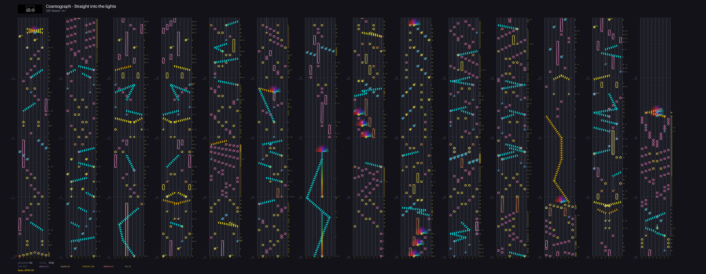

# Simai Chart Renderer

Python 编写的 Maimai DX Simai 谱面可视化渲染工具。将 Simai 格式谱面解析并渲染为高清图片。

Python 3.10+ | MIT License

## 功能特性

| 特性 | 说明 |
|------|------|
| 三种输入方式 | 直接文本、文件、压缩包(含 maidata.txt + 背景图) |
| 多难度选择 | 自动检测多个难度，控制台交互选择 |
| 完整音符支持 | Tap, Hold, Touch, TouchHold, Slide, Break, EX, Each |
| 多段 Slide | 支持 * 连接多个终点、/ 分隔混合组 |
| 分音标注 | 自动根据相邻音符间隔计算并标注分音等级 |
| BPM 检测 | 支持曲中 BPM 变更，低 BPM 自动拉伸(4小节/Unit) |
| 烟花特效 | Touch Firework 半圆形彩虹渐变效果 |
| 背景图 | 支持自动提取压缩包背景图并嵌入渲染结果 |
| 统计信息 | 渲染底部显示 Measures, TOTAL, TAP, HOLD, SLIDE, TOUCH, BREAK, EX 数量 |
| 字节流输出 | 提供 render_to_bytes() 接口，可直接对接聊天机器人 |

## 安装与使用

### 安装依赖

```bash
pip install -r requirements.txt
```

### 快速开始

**直接输入谱面文本：**

```bash
python main.py -t "(120){4}1,3,5,7,2h[4:1],4,6,8," -o output.png
```

**从文件读取：**

```bash
python main.py -f input.simai -o output.png
```

**从压缩包读取（含多难度选择）：**

```bash
python main.py -z "Fine Logic no pv.zip" -o output.png
```

### 参数说明

| 参数 | 说明 |
|------|------|
| `-t`, `--text` | 直接输入 Simai 谱面文本 |
| `-f`, `--file` | 谱面文件路径 (.simai / .txt) |
| `-z`, `--zip` | 压缩包路径 (含 maidata.txt + 背景图) |
| `-o`, `--output` | 输出图片路径 (默认: output.png) |

注意: -t, -f, -z 三个参数互斥，必须且只能使用其中一个。

### 输出示例



## 项目架构

项目分为三个核心模块和一个入口：

```
main.py  (命令行入口)
  |
  +-- simai_maidx.py  (maidata.txt 解析: &元数据提取、多难度选择)
  |     |
  |     +-- parse_maidata()      -- 解析 &title/&artist/&lv/&inote 等元数据
  |     +-- select_difficulty()  -- 控制台交互选择难度
  |     +-- handle_zip()         -- 压缩包解压 + 背景图提取
  |
  +-- simai_parser.py  (Simai 语法解析: 文本 -> 音符对象)
  |     |
  |     +-- SimaiParser.parse()  -- 入口, 返回 SimaiNote 列表
  |     +-- BPM 事件提取、分组解析、音符修饰解析
  |
  +-- simai_render.py  (渲染引擎: 音符对象 -> 图片)
        |
        +-- ChartCanvas.render()  -- 入口, 返回 PIL.Image
        +-- render_chart()        -- 保存到文件
        +-- render_to_bytes()     -- 返回字节流 (对接机器人)
```

### 数据流

```
Simai 文本字符串
    |
    v
SimaiParser.parse()
    |  按逗号分组, 逐组解析音符类型和修饰
    |  输出: List[SimaiNote] + bpm_events
    v
ChartCanvas(notes, bpm_events).render()
    |  计算时间-像素映射, 分 Unit 渲染
    |  输出: PIL.Image
    v
输出 PNG 图片 / 字节流
```

## 开发者文档

### 架构概览

渲染流水线分为三个阶段：

1. **输入阶段** (main.py / simai_maidx.py): 处理三种输入源，提取纯 Simai 文本字符串
2. **解析阶段** (simai_parser.py): 将文本解析为结构化的 SimaiNote 对象列表
3. **渲染阶段** (simai_render.py): 将音符对象映射到像素坐标，绘制为图片

### SimaiNote 字段说明

| 字段 | 类型 | 说明 |
|------|------|------|
| `type` | str | 音符类型: "tap", "hold", "touch", "touchhold", "slide" |
| `btn` | int | 按钮编号 1-8 |
| `column` | int | 渲染列索引 (8 - btn) |
| `end_column` | int | Slide 终点列索引 |
| `sensor` | str | Touch 传感器 ID, 如 "A1", "B3", "C", "D2", "E4" |
| `break_note` | bool | Break 音符 |
| `ex` | bool | EX 音符 |
| `each` | bool | Each 修饰 |
| `pseudo_each` | bool | 伪 Each (' 分隔) |
| `slide_star_each` | bool | 混合组中 Slide 星星显示 Each |
| `firework` | bool | 烟花特效 |
| `shape` | str | Slide 形状标识符 |
| `end_btn` | int | Slide 终点按钮 |
| `multi_slides` | list | * 连接的多 Slide 列表 |
| `slide_start_break` | bool | Fb 起点 Break |
| `no_start_star` | bool | F? / F! 无起点星星 |
| `force_circle` | bool | F@ 强制回环 |
| `duration` | list | [x, y] 时长 (hold/slide) |
| `duration_sec` | float | [#s] 秒数时长 |
| `slide_timing` | dict | {"tame_beats": 0, "slide_beats": 0} |
| `raw_bracket` | str | 原始 [] 内容 |
| `beat_pos` | float | 起始时间位置 (bar 为单位) |
| `end_beat_pos` | float | 结束时间位置 (bar 为单位) |

### SimaiParser API

```python
class SimaiParser:
    def __init__(self, text: str)
        # text: 纯 Simai 文本 (不含 & 元数据)

    def parse(self) -> List[SimaiNote]
        # 解析入口，返回音符列表
        # 也会设置 self.bpm_events (List[dict])

    def get_note_count(self) -> int
        # 返回总音符数
```

### 渲染 API

```python
# 保存到文件
def render_chart(
    notes: List[SimaiNote],
    bpm_events: List[dict],
    output: str = "output.png",
    first_offset: float = 0.0,
    song_info: dict = None,
    bg_img_path: str = None
) -> str
    # 返回输出图片路径

# 返回字节流 (适合聊天机器人)
def render_to_bytes(
    notes: List[SimaiNote],
    bpm_events: List[dict],
    first_offset: float = 0.0,
    song_info: dict = None,
    bg_img_path: str = None
) -> bytes
    # 返回 PNG 格式的图片字节流
```

### 对接聊天机器人

通过 `render_to_bytes()` 接口可以方便地将渲染结果接入聊天机器人。以下是一个对接 nonebot2(qq机器人) 的示例：

```python
from io import BytesIO
from simai_parser import SimaiParser
from simai_render import render_to_bytes

# 从谱面文本
text = "(120){4}1,3,5,7,2h[4:1],4,6,8,"
parser = SimaiParser(text)
notes = parser.parse()
bpm_events = parser.bpm_events

# 渲染为字节流
img_bytes = render_to_bytes(notes, bpm_events)

# 发送 (以 nonebot2 为例)
await bot.send_group_msg(
    group_id=group_id,
    message=MessageSegment.image(img_bytes)
)
```

也可以继承 ChartCanvas 自定义渲染行为：

```python
from simai_render import ChartCanvas

class MyCanvas(ChartCanvas):
    def _draw_song_header(self):
        # 自定义顶部信息
        super()._draw_song_header()
        # 额外绘制...
```

### 渲染流程

ChartCanvas.render() 的渲染顺序：

1. `_draw_song_header()` -- 顶部歌曲信息 + 背景图 (最底层)
2. `_draw_grid()` -- 网格线 + 轨道编号
3. `_draw_info()` -- 小节编号、时间、BPM 标注、统计
4. `_draw_subdivision_annotations()` -- 分音等级标注
5. `_draw_firework_effect()` -- 烟花特效 (在网格上方)
6. `_draw_hold_bar_only()` / `_draw_touchhold_bar_only()` / `_draw_slide_line_only()` -- 长条/滑条 (中间层)
7. `_draw_tap()` / `_draw_hold_head()` / `_draw_touch()` / `_draw_slide_head()` -- 音符贴图 (最上层)

### 如何扩展

**添加新的音符修饰：**

1. 在 `SimaiNote.__init__` 中添加新字段
2. 在 `SimaiParser._parse_single_note` 中添加修饰检测逻辑
3. 在 `ChartCanvas` 中添加对应的渲染方法

**添加新的渲染特效：**

1. 在 `ChartCanvas.render()` 中确定渲染层级
2. 编写特效绘制方法，使用 `self.draw` (ImageDraw) 或 `self.img.paste` 操作像素

## 已知问题 / TODO

- 渲染大谱面时内存占用较高 (3072px 高度固定，宽度随 Unit 数增长)
- 部分 Slide 形状的起点和终点判定可能存在偏差
- 极少数情况下分音标注的映射不够精确 (相邻 delta 不在预设表中时取最近值)
- 暂无批处理模式 (一次渲染多个谱面)

## 项目结构

```
chartForSimai/
  main.py                命令行入口
  simai_parser.py        Simai 谱面语法解析器
  simai_maidx.py         maidata.txt / 压缩包解析模块
  simai_render.py        谱面渲染引擎
  requirements.txt       Python 依赖 (pillow)
  LICENSE                MIT 许可证
  README.md              本文件
  test_spectrum.simai    测试谱面 (Master/Expert)
  src/                   音符贴图资源
    tap.png / tap_break.png / tap_each.png / tap_ex.png
    hold.png / hold_break.png / hold_each.png / hold_ex.png
    hold_body.png / hold_break_body.png / hold_each_body.png / hold_ex_body.png
    slide.png / slide_break.png / slide_each.png
    star.png / star_break.png / star_each.png / star_ex.png
    star_double.png / star_double_break.png / star_double_each.png / star_double_ex.png
    touch.png / touch_each.png
    touchhold.png
```

## 注意事项

本项目主要由 Vibecoding (AI 辅助编程) 完成，代码结构和实现思路可能存在不完善之处。欢迎提交 Issue 或 Pull Request 改进。

## 许可证

本项目基于 MIT 许可证开源，详见 [LICENSE](LICENSE) 文件。
